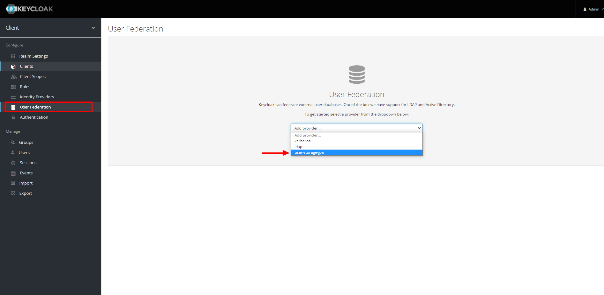
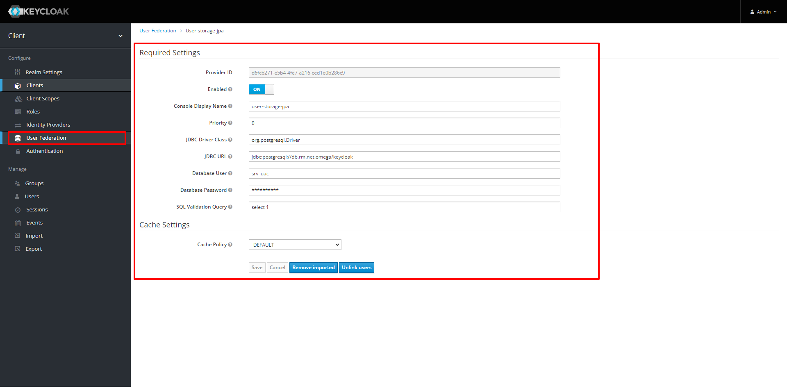

user-storage-jpa: User Storage Provider with EJB and JPA
========================================================

Source: <https://github.com/keycloak/keycloak-quickstarts>  

What is it?
-----------

This is an example of the User Storage SPI implemented using EJB and JPA.  It shows you how you might use these components
to integrate Keycloak with an existing external custom user database.  The example integrates with a simple relational
database schema that has one user table that stores a username, email, phone number, and password for one particular user.
Using the User Storage SPI this table is mapped to the Keycloak user metamodel so that it can be consumed by the Keycloak
runtime. Before using this example, you should probably read the User Storage SPI chapter of our server developer guide.

The deployment module flow:
----------------------------

create maven job - mvn clean package

the *.jar file from target directory
copy to the Keycloak server by path <keycloak_path>/standalone/deployments

the deployment process will start automatically, as the result you can see the
file <jar_file_name>.jar.deployed in<keycloak_path>/standalone/deployments .
The result of the deployment process - the file with the name of deployed module (jar file name)
and in the end of file name will be the status of deployed procedure,
deployed - successfully deployed, failed - failed deployed, undeployed - undeployed.

Enable the Provider for a Realm
-------------------------------
Login to the Keycloak Admin Console and got to the User Federation tab.   
You should now see your deployed provider in the add-provider list box.
Add the provider, save it. This will now enable the provider for the realm.  
Because this provider implements the UserRegistrationProvider interface, any new user you create in the
admin console or on the registration pages of Keycloak, will be created in the custom store used by the provider.  
If you go to the Users tab in the Admin Console and create a new user, you'll be able to see the provider in action.

All options will be set automatically from module, but it's possible to change it.

